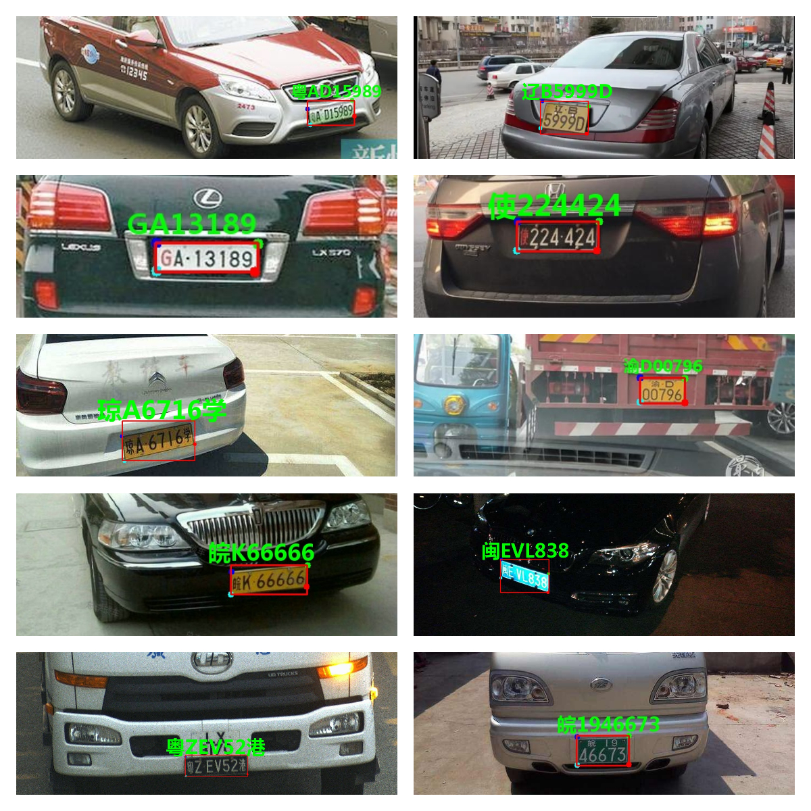

# **yolov7车牌识别算法，支持12种中文车牌类型**

**1.单行蓝牌**
**2.单行黄牌**
**3.新能源车牌**
**4.白色警用车牌**
**5 教练车牌**
**6 武警车牌**
**7 双层黄牌**
**8 双层武警**
**9 使馆车牌**
**10 港澳牌车**
**11 双层农用车牌**
**12 民航车牌**

**测试demo:**
以yolov7-lite-s 为例:
```
python detect_rec_plate.py --detect_model weights/yolov7-lite-s.pt  --rec_model weights/plate_rec.pth --source imgs --output result
```

测试文件夹imgs，结果保存再 result 文件夹中

## **车牌检测训练**

1. 下载数据集：  [datasets](https://pan.baidu.com/s/1xa6zvOGjU02j8_lqHGVf0A) 提取码：pi6c 数据从CCPD和CRPD数据集中选取并转换的
   数据集格式为yolo格式：

   ```
   label x y w h  pt1x pt1y pt2x pt2y pt3x pt3y pt4x pt4y
   ```

   关键点依次是（左上，右上，右下，左下）
   坐标都是经过归一化，x,y是中心点除以图片宽高，w,h是框的宽高除以图片宽高，ptx，pty是关键点坐标除以宽高
2. 修改 data/plate.yaml    train和val路径,换成你的数据路径

   ```
   train: /your/train/path #修改成你的路径
   val: /your/val/path     #修改成你的路径
   # number of classes
   nc: 2                 #这里用的是2分类，0 单层车牌 1 双层车牌

   # class names
   names: [ 'single','double']

   ```
3. 训练
以yolov7-lite-s 为例:
   ```
   python train.py  --batch-size 32 --data data/plate.yaml --img 640 640 --cfg cfg/yolov7-lite-s.yaml --weights weights/yolov7-lite-s.pt --name yolov7 --hyp data/hyp.face.yaml
   ```

   结果存在run文件夹中

## **车牌识别训练**

车牌识别训练链接如下：

[车牌识别训练](https://github.com/we0091234/crnn_plate_recognition)

支持如下：



## 部署

* [onnx导出与推理](https://github.com/we0091234/yolov7_plate/tree/master/onnx)
* [tensorrt推理](https://github.com/we0091234/yolov7_plate/tree/master/tensorrt)
* [NCNN推理](https://github.com/we0091234/NCNN_SAMPLE/tree/master/ncnn_plate_v7)

## References

* [https://github.com/derronqi/yolov7-face](https://github.com/derronqi/yolov7-face)
* [https://github.com/qinggangwu/yolov7-pose_Npoint_Ncla](https://github.com/qinggangwu/yolov7-pose_Npoint_Ncla)
* [https://github.com/WongKinYiu/yolov7](https://github.com/WongKinYiu/yolov7)
* [https://github.com/TexasInstruments/edgeai-yolov5/tree/yolo-pose](https://github.com/TexasInstruments/edgeai-yolov5/tree/yolo-pose)
* [https://github.com/WongKinYiu/yolov7/tree/pose](https://github.com/WongKinYiu/yolov7/tree/pose)

**有问题可以提issues 或者加qq群:823419837 询问**

